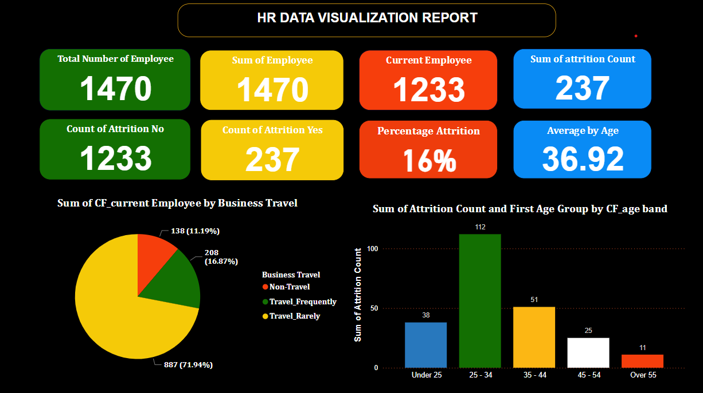
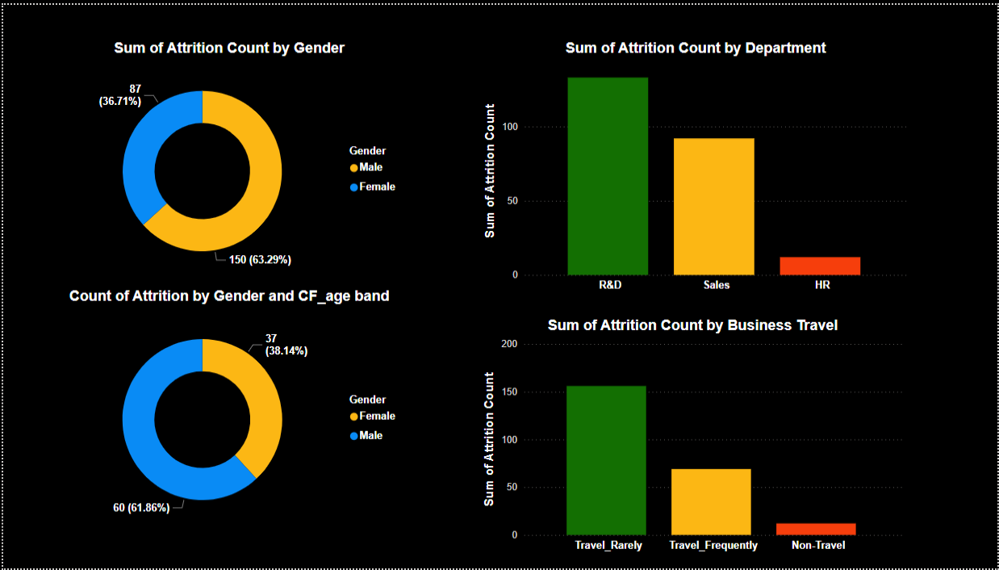
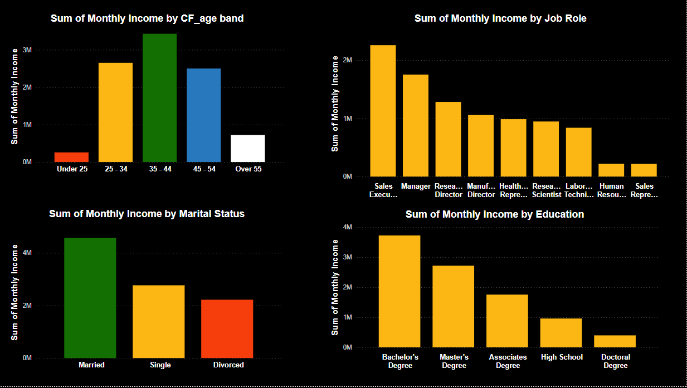
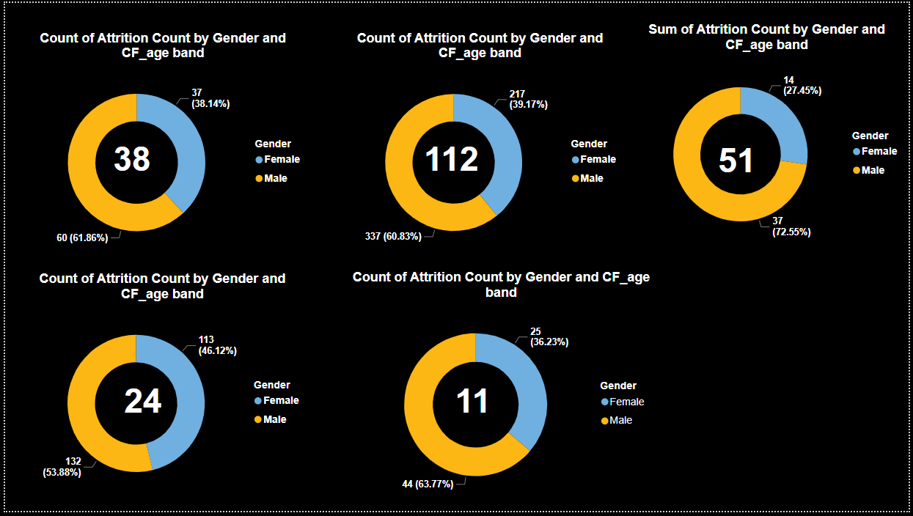
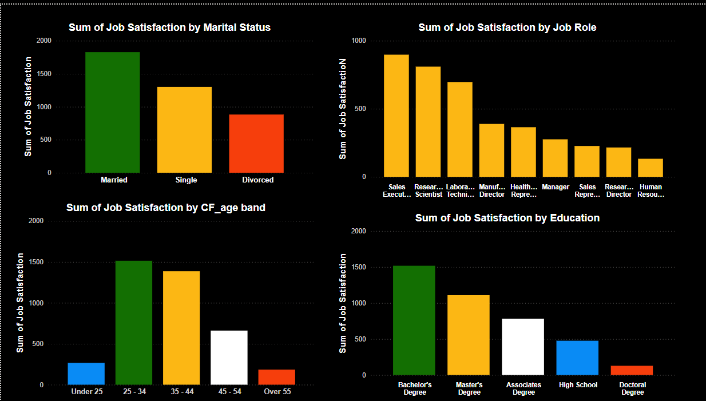

# HR-Data-Anaylysis-and-Report
This is a personal project carried out during the Future Clan Bootcamp.
## Table of Content
Introduction

Problem statement

Project Aims

Project Significance

Data Source

Tool Used

Data Transformation and Loading

Data Analysis and Visualization

Insights

Recommendation

Conclusion

- - -

## Introduction
The aim of this project is to develop an interactive dashboard that provide a comprehensive overview of election results across various states and geopolitical zones.
The dashboard will also provide key metrics such as total votes per party, distribution of vote according to geo-political zone and how each candidate performance in general. 

## Problem Statement

The organization is facing a critical issue of high employee attrition and low job satisfaction, particularly among specific demographic groups such as young employees, females, and those in the R&D department. Additionally, older employees and those with Doctoral degrees report lower job satisfaction, and compensation structures may be contributing to this issue. If left unaddressed, these problems will continue to negatively impact productivity, morale, and overall organizational performance. The organization needs to develop and implement targeted strategies to improve employee retention and satisfaction, ensuring a more supportive and inclusive work environment that fosters growth and success.

## Project Aims

The project aims to improve employee retention and satisfaction by addressing high attrition rates in specific demographic groups, enhancing job satisfaction for older employees, reviewing and adjusting compensation structures, promoting job satisfaction across all demographics, and fostering a balanced focus beyond marketing. The project will develop and implement targeted strategies to:
•	Reduce attrition rates among employees aged 25-34 and females
•	Improve job satisfaction among older employees and those with Doctoral degrees
•	Enhance compensation structures and opportunities for professional development
•	Create a supportive work environment for all demographics
•	Balance organizational growth by recognizing and resourcing critical departments beyond marketing

## Project Significance

By achieving these aims, the project will significantly improve employee retention and satisfaction, leading to increased productivity, better morale, and improved customer satisfaction. The project will also contribute to the organization's long-term success and competitiveness, ensuring a more positive and engaged workforce, and ultimately driving business growth and profitability.

## Data Source
https://docs.google.com/spreadsheets/d/1Yg1meJ2l2-4_YI-ELaJx9FowuHy8b1TL/edit?usp=sharing&ouid=116013626164238245642&rtpof=true&sd=true

## Tool Used
- **Ms Excel** [Download here](https://www.microsoft.com)
- **Microsoft Power BI** [Donwload here](https://www.microsoft.com/en-us/download/details.aspx?id=58494)

## Data Transformation and Loading

## Data Analysis and Visualization

## Insights

-The company has 1470 employees, out of which 1233 employees are still working and 237 have left the company. The attrition rate is 16%. The average age of employees is 36.92 years. The company has a high proportion of employees (71.94%) who travel rarely, followed by those who travel frequently (16.87%) and those who don't travel (11.19%). The age group of 25-34 has the highest number of attrition, followed by the age group of 35-44. The youngest age group (under 25) has a relatively lower number of attrition.

-The majority of attrition is from males, with a 63% contribution. The department with the highest attrition is R&D. Among business travelers, most attrition comes from those who travel rarely.

-Looking at the sum of monthly income by different factors such as age, marital status, job role, and education.  The highest income is earned by people aged 35-44, followed by those aged 45-54. The lowest income is earned by people under 25. Also, married people earn the highest income, followed by singles and then divorced people. While people in Sales Executive roles earn the highest income, followed by Managers. The lowest income earners are Human Resources and Sales Representatives. and people with a Bachelor's Degree earn the highest income, followed by those with Master's Degrees. High school graduates earn the lowest income.

-The dashboard shows the count of attrition by gender and CF_age band. We can see that male employees are more likely to attrit than female employees. The attrition rate is highest for the age band 37 and 217.

-According to recent findings, marital status, job role, age, and education level all have a significant impact on job satisfaction. Notably, married employees report the highest levels of job satisfaction, followed closely by single employees, and then divorced employees. In terms of job roles, Sales Executives top the list, with Research Scientists, Laboratory Technicians, Manufacturing Directors, and Health & Safety Representatives also ranking highly. When it comes to age, employees between 25-34 years old are the most satisfied, followed by those aged 35-44, and then those aged 45-54. Interestingly, education level also plays a role, with employees holding a Bachelor's Degree reporting the highest job satisfaction, likely due to their higher earning potential. Those with a Master's Degree follow closely, while employees with an Associate's Degree and those with a Doctoral degree report lower job satisfaction, which may be attributed to the anomaly of lower earnings despite their advanced education.

## Recommendation

1.	Address High Attrition in Specific Groups:
    -Implement targeted retention strategies for employees aged 25-34 and females.
 	  -Investigate the high attrition rate in the R&D department and implement measures to address the underlying causes.
  	
2.	Enhance Job Satisfaction for Older Employees:
 	 -Develop programs to increase job satisfaction among employees aged 55 and above, such as flexible work arrangements or roles that better match their experience.
  	
3.	Review and Adjust Compensation Structures:
	 -Reevaluate the compensation packages for employees with Doctoral degrees to ensure they are competitive and fair.
   -Continue to recognize and reward high-performing sales executives while ensuring other departments are also adequately compensated.
   -The company could focus on providing more opportunities for professional development for employees with an Associate's Degree, as they have lower job satisfaction compared to those with 
    a Bachelor's or Master's Degree.

4.	Promote Job Satisfaction Across All Demographics:
    -Focus on creating a supportive work environment for younger employees (under 25) to improve their job satisfaction.
    -Ensure that job satisfaction initiatives also target single and divorced employees to create a more inclusive work culture.
  	
5.	Foster a Balanced Focus Beyond Marketing:
    -While the organization’s emphasis on marketing is evident, ensure that other critical departments receive adequate resources and recognition to balance overall organizational growth.

 By addressing these key areas, the organization can improve employee retention and satisfaction, leading to a more productive and harmonious work environment.

## Conlcusion

In conclusion, by addressing high attrition rates in specific demographic groups, enhancing job satisfaction for older employees, adjusting compensation structures, promoting job satisfaction across all demographics, and fostering a balanced focus beyond marketing, the organization can significantly improve employee retention and overall satisfaction. Implementing these targeted strategies will not only create a more supportive and inclusive work environment but also contribute to greater productivity and organizational harmony. By recognizing and addressing the unique needs and concerns of different employee groups, the company can ensure sustained growth and success.
