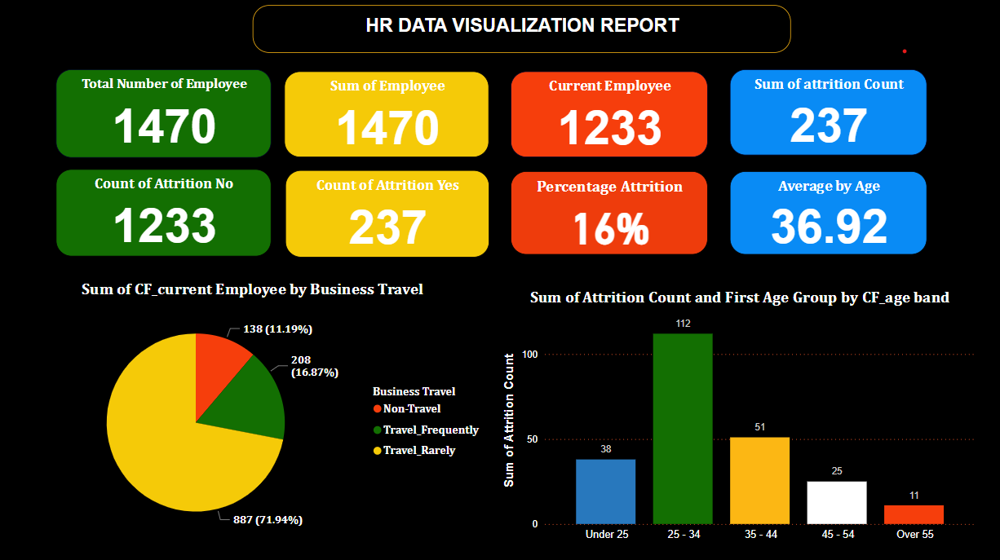

# HR-Data-Anaylysis-and-Report
This is a personal project carried out during the Future Clan Bootcamp.
## Table of Content
Introduction

Problem statement

Project Aims

Project Significance

Data Source

Tool Used

Data Transformation and Loading

Data Analysis and Visualization

Insights

Recommendation

Conclusion

- - -

## Introduction
The aim of this project is to develop an interactive dashboard that provide a comprehensive overview of election results across various states and geopolitical zones.
The dashboard will also provide key metrics such as total votes per party, distribution of vote according to geo-political zone and how each candidate performance in general. 

## Problem Statement

The organization is facing a critical issue of high employee attrition and low job satisfaction, particularly among specific demographic groups such as young employees, females, and those in the R&D department. Additionally, older employees and those with Doctoral degrees report lower job satisfaction, and compensation structures may be contributing to this issue. If left unaddressed, these problems will continue to negatively impact productivity, morale, and overall organizational performance. The organization needs to develop and implement targeted strategies to improve employee retention and satisfaction, ensuring a more supportive and inclusive work environment that fosters growth and success.

## Project Aims

The project aims to improve employee retention and satisfaction by addressing high attrition rates in specific demographic groups, enhancing job satisfaction for older employees, reviewing and adjusting compensation structures, promoting job satisfaction across all demographics, and fostering a balanced focus beyond marketing. The project will develop and implement targeted strategies to:
•	Reduce attrition rates among employees aged 25-34 and females
•	Improve job satisfaction among older employees and those with Doctoral degrees
•	Enhance compensation structures and opportunities for professional development
•	Create a supportive work environment for all demographics
•	Balance organizational growth by recognizing and resourcing critical departments beyond marketing

## Project Significance

By achieving these aims, the project will significantly improve employee retention and satisfaction, leading to increased productivity, better morale, and improved customer satisfaction. The project will also contribute to the organization's long-term success and competitiveness, ensuring a more positive and engaged workforce, and ultimately driving business growth and profitability.

## Data Source
https://docs.google.com/spreadsheets/d/1Yg1meJ2l2-4_YI-ELaJx9FowuHy8b1TL/edit?usp=sharing&ouid=116013626164238245642&rtpof=true&sd=true

## Tool Used
- **Ms Excel** [Download here](https://www.microsoft.com)
- **Microsoft Power BI** [Donwload here](https://www.microsoft.com/en-us/download/details.aspx?id=58494)

## Data Transformation and Loading

## Data Analysis and Visualization

## Insights

## Recommendation

## Conlcusion

In conclusion, by addressing high attrition rates in specific demographic groups, enhancing job satisfaction for older employees, adjusting compensation structures, promoting job satisfaction across all demographics, and fostering a balanced focus beyond marketing, the organization can significantly improve employee retention and overall satisfaction. Implementing these targeted strategies will not only create a more supportive and inclusive work environment but also contribute to greater productivity and organizational harmony. By recognizing and addressing the unique needs and concerns of different employee groups, the company can ensure sustained growth and success.
